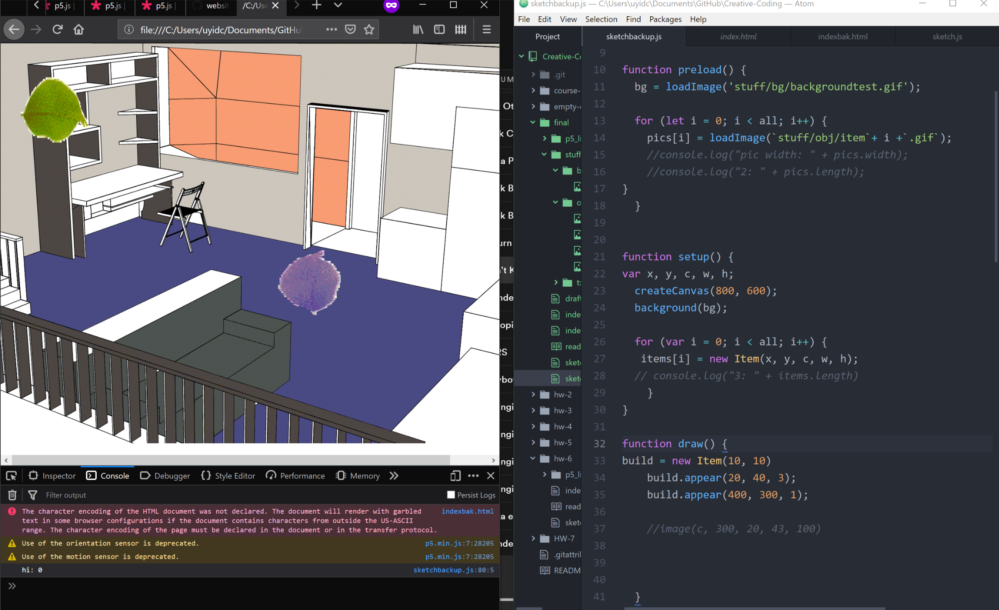

# Ellis Vaughn
My planned final is a point and click game based on a short story I started a year ago called Cassini, 1st C. It's about a person who lives in a city located on Titan, Saturn's moon.
### Outline
The game will mostly contain the protagonist's apartment with a few items that pop up text to tell a small story. There will be a few items that have a couple frames of animation, like blinds on a window or something similar.
Instead of building using p5 shapes I want to load my own art. Sketchup is a simple 3d model program that works well for backgrounds, and you can export 2D outlines into Adobe Illustrator.

In terms of work that is an inspiration, the only p5 examples are things like Daniel Shiffman's tutorial examples. Outside of that are 90s PC games like Myst, focused on environments and tone instead of reacting to events in real time. Visually I want a style that's simple and suited to p5, for the sake of cleanliness as well as file size.
Here are two playlists I've made based on this story, not for this project superficially but because I do it with most of my writing.

### Mechanics
I'll have to learn a lot more about how classes function and specifically object arrays. Having things in an array that aren't all identical is complicated to deal with, but its better than individually needing to tend to every item. I don't know how I will get the interactive items to call to the right text, or how the items themselves can check this information. Using Boolean logic to set up progression seems like the obvious choice, but it might be complicated with the array.

### Prep work

