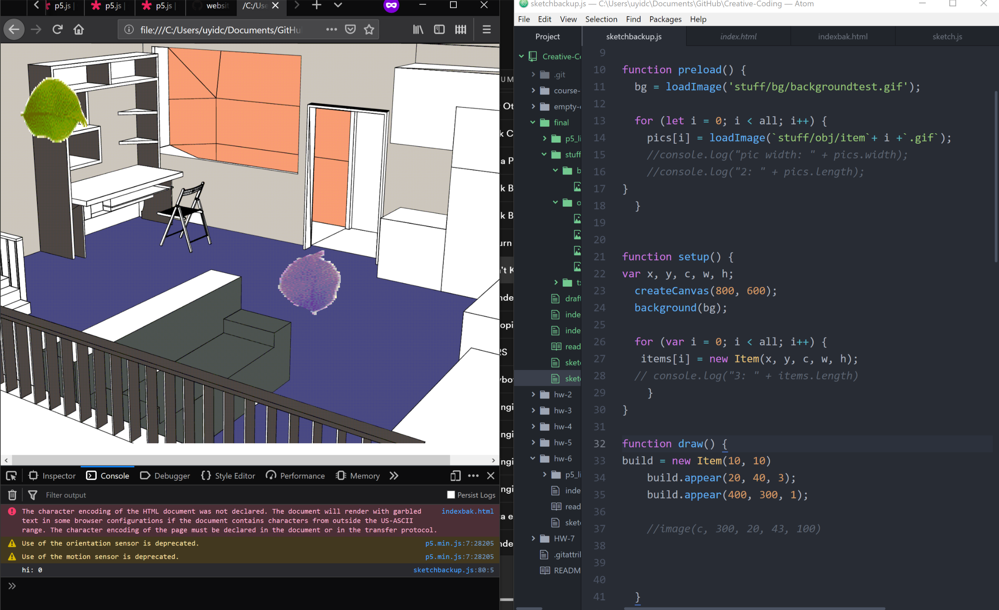
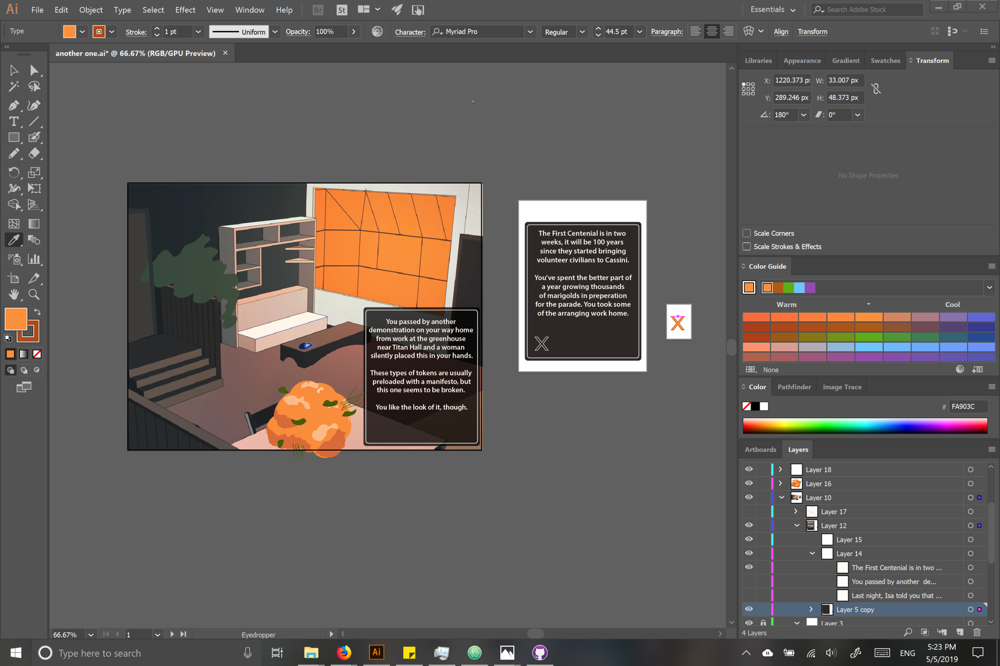
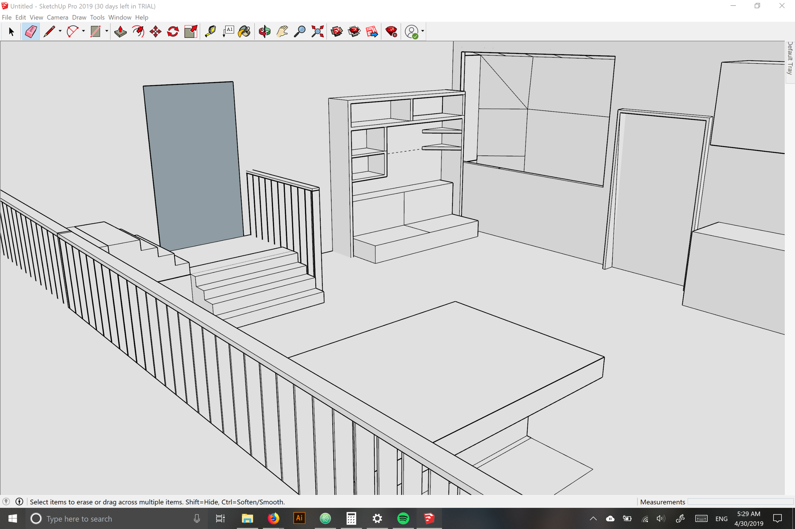

# Ellis Vaughn
### Final Summary
1. I learned as much as I could about the specific mechanics of what I wanted in my project, mostly having to do with displaying images and mouse interaction.
2. Loaded test images into an object array, and experimented with different mouse events.
3. Created an "advance" function to different elements on and off after I moved the background into draw.
4. Loaded in text, and worked on how to get them to "pop up" corresponding to the clicked item.
5. Got this to work when background was in setup, but after moving it to draw I continued to have issues with the display functions.   
6. All throughout the coding process, created assets.

### Process

I realized very quickly that I was in over my head with this one, but it was some of the most fun I've had on a project. I plan on finishing it over the summer.
This is based off of a short story that I've had an outline for since a few years ago, and science fiction seemed like a good match for this style. I used the 3D modeling tool Sketchup to create a base for the room (the only premade asset I used was the chair), that I added color/effects to in a couple Adobe programs.
I chose .gifs because of their file size, but I think I'll use .pngs for at least the images. I genuinely like the almost half-tone look of gif compression for the background, however.

### Issues
I started coding this with the intention to have multiple "rooms", with a certain number of items that need to be clicked before they appeared. It's absolutely still possible but I lost a lot of time figuring out how to work with looping array items, and how to interact with their specific variables.
Although the concept of having the text tied to the images via the same array number makes sense, calling that number didn't work as I expected because of the display loop.  

I realized that because "mousePressed" doesn't loop, I could call it there, and make a boolean "switch", but as I was working out the inheritance I ran out of time.
