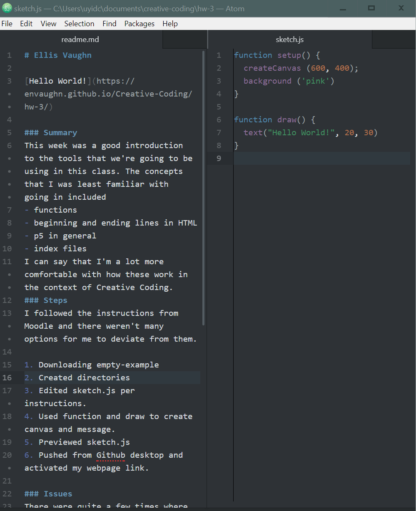

# Ellis Vaughn

[Hello World!](https://envaughn.github.io/Creative-Coding/hw-3/)

### Summary
This week was a good introduction to the tools that we're going to be using in this class. The concepts that I was least familiar with going in included
- Functions
- Beginning and ending lines in HTML
- Using p5 in general
- Index files

I can say that I'm a lot more comfortable with how these work in the context of Creative Coding.
### Steps
I followed the instructions from Moodle and there weren't many options for me to deviate from them.

1. Downloading empty-example
2. Created directories
3. Edited sketch.js per instructions.
4. Used function and draw to create canvas and message.
5. Previewed sketch.js
6. Pushed from Github desktop and activated my webpage link.

### Issues
There were quite a few times where I forgot to save and kept wondering why my code was broken, so I'll just need to get into the habit of saving before opening the index file. Other than that, this felt like a very self explanatory assignment and it went smoothly.

### Further Discussion & Peers
Once again, the things I want to learn more about are things like p5 in general, so I'm looking forward to exploring them.
I worked on this assignment with a classmate, so any minor troubleshooting  was able to be done then without the website and was mostly down to syntax errors or menu items we couldn't find right away.
### Image

*(NOTE: The dimensions are strange because I access my PC remotely from my Chromebook, so I don't need to take my 10lb laptop everywhere.)*
