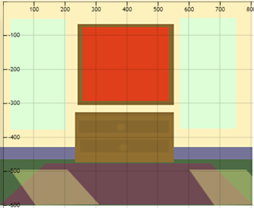

## Ellis Vaughn
### Week Summary
1. For this assignment I was introduced to animation and the importance of variables in p5.
2. I ended up watching a lot of The Coding Train videos
3. Made a draft in Photoshop so I could understand what I wanted things to look like, but I deviated from it quite a lot.
4. This project has the painting, which has 3 ellipses controlled by mouse input, background color changes, and the train moving on it's own, made up of 7 rectangles that moves at the same rate behind the wall.

### Process
This assignment made me a lot more comfortable with p5, and doing this I stumbled onto a lot of different tools and functions that I wanted to implement into this, but knew I would get the chance later on.

- At first the mouse controlled animation was going to be a 1/2 opacity beam of light coming through the windows while the painting would move on its own. I found a way to animate the individual points on the quadrilateral at a different rate so it would skew to mimic the angle of the sun, but adjusting the modulo limit so it wouldn't destroy itself after one run seemed like a bleak chore. I think I could make it work with a frameCount "if" function, so I figured I would save that for a later assignment, and the train is more visually substantial anyway.

- After making my draft I did worry that I'd set out to do something too complicated, but animating a small scene is something I've been wanting to do for so long, that I was willing to put in the time even if I'm in catch-up mode.

- Using translate helped a lot with the train, because I could move the loop point off canvas so none of the elements blinked in and out. I used it in the painting thinking I was going to do a rotating animation but I really like the effect of the circle sizes.

- I'm not sure if I was supposed to use the modulo function as much as I did here but it saved me in pretty much every aspect, especially with the train.

- During my last assignment I've realized how poorly my laptop monitor displays colors, because it's a matte "gaming" display, so I've made a habit of taking screenshots and sending them to my phone periodically (that also displays colors strangely, but in a different way).

### Issues
I mentioned before my issue with the window reflections, I was able to translate the points along the x-axis at a different rate so it looked like it was moving across the floor, but I just couldn't figure out how to reset the animation without completely losing the integratiy of the shape. I think there is a way to write an " if frameCount > x " statement that would work but I knew that was a couple assignments ahead, and had other animations to work on.

### Further Discussion & Peers
This was a very exciting assignment! Recently I've been looking at PC games from the 90's that were essentially "just" animated environments and an accompanying story, I've been wanting to do something web-based for the fiction I write. This felt like a really good step in the right direction!

### Monster Drafts (Bonus)

